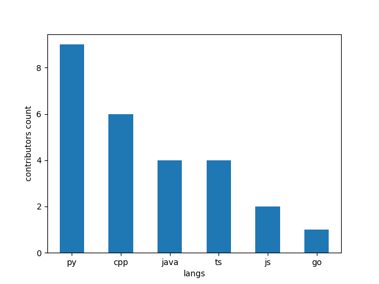

# Contributors
We have 19 contributors.

| nickname   | github        | langs                | first_commit   |
|:-----------|:--------------|:---------------------|:---------------|
| any        | dataprob      | ['py', 'js']         | 05/26/2023     |
| youssef    | ysaleh03      | ['cpp']              | 05/27/2023     |
| blank      | Person314159  | ['cpp']              | 05/27/2023     |
| Requiem    | PhaseRush     | ['py', 'java', 'ts'] | 05/28/2023     |
| eater      | william-swy   | ['cpp']              | 05/29/2023     |
| Haad       | hbhutta       | ['cpp']              | 05/29/2023     |
| Gordon     | Hgjnnf        | ['py']               | 06/02/2023     |
| Saif       | darksword99   | ['py']               | 06/05/2023     |
| aaryan     | aaryan-rampal | ['java']             | 06/06/2023     |
| yimeng     | ymnglli       | ['py']               | 06/08/2023     |
| Jason      | argonaut0     | ['go']               | 06/15/2023     |
| alex       | azalexzhang   | ['py']               | 07/03/2023     |
| Nothingyet | hquanvo       | ['cpp']              |                |
| eric       | eysk-io       | ['java']             |                |
| Ryan       | ryanmckim     | ['py']               |                |
| RasPoutine | nopunindented | ['py', 'js', 'ts']   |                |
| dinosaur   | Ccolina03     | ['java', 'ts']       |                |
| kiara      | kcoton        | ['py']               |                |
| joel       | joelbonnie    | ['cpp']              |                |