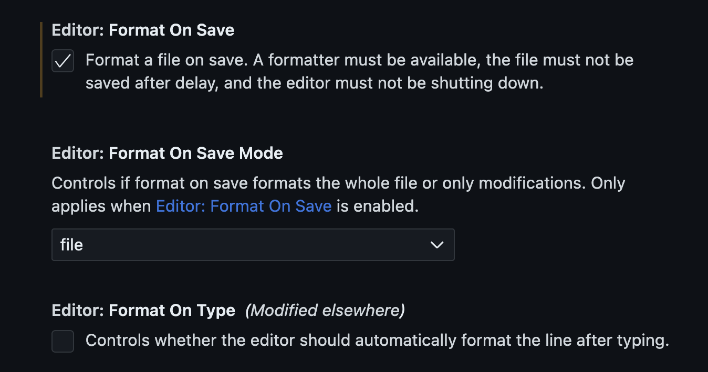
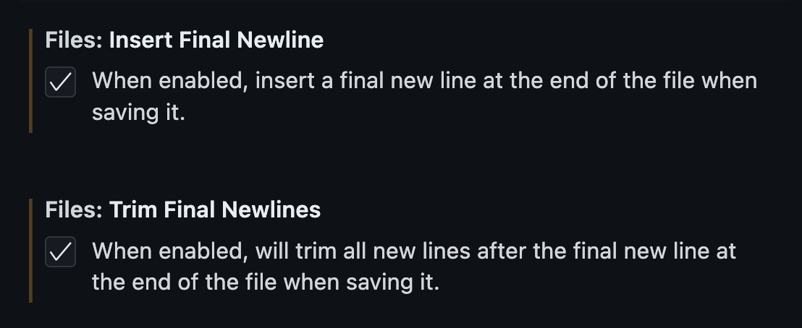
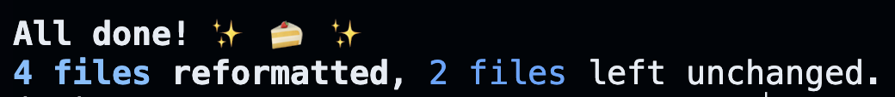
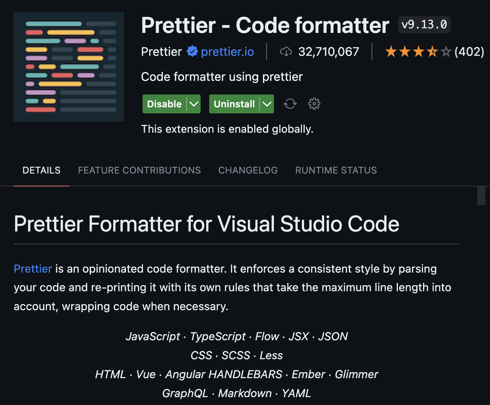

# Formatting

Before uploading your code, please format it with a code formatter.

Definition from [freeCodeCamp](https://www.freecodecamp.org/news/using-prettier-and-jslint/)

> Code formatters are automated tools that help you format source code _automatically_. The main purpose of code formatters is to standardize the formatting of code across a project or team, making it **easier to read and understand code**.

## Editor

1. Auto format when you save the file
   
2. Auto add only 1 newline
   
3. Can also use keyboard shortcut `shift + option + f` to format file

## C++

`blank` uses Google-style formatting, with a few custom options. A `.clang-format` file with said options is provided.

On Linux, if you have `clang-format` installed, you can run `find . -iname *.cpp | xargs clang-format -style=file -i` when in the project root directory to format all of the files according to the rules above. Rules are subject to change.

## Python

`annie` uses [black](https://github.com/psf/black).

- To install, use `pip install black`. VSCode doesn't have black pre-installed, even though it shows black as an option.

- To run on 1 file, use `shift + option + f`

- To bulk run, use `black {source_file_or_directory}`. Best to do a final check with

```shell
black src/python/
black test/python/
```

Output e.g.


## JS and Markdown

`annie` uses [prettier](https://prettier.io/).

- To install, search for prettier in VSCode extension. Then you are all set!
  

## Test cases JSON

Upload to the `test/test_json` directory. Format:

```
[
    {
        "contributor": ...,
        "input": {
            "input1": ...,
            ...
        },
        "output": ...
    },
    ...
]
```

Input names should match the argument/example input parameter names. Given test cases (examples) have `"given"` as contributor.

If the problem allows the answer to be returned in any order, or similar:

- sort each entry in the output list, if necessary (list of lists)
- sort the entire output list
- add the **sorted** answer in JSON, and add code to sort the result in the test file. (see [`test/cpp/test_17.cpp`](../test/cpp/test_17.cpp), [`test/test_json/test_17.json`](../test/test_json/test_17.json))

If multiple correct answers:

- add a **list** of all correct answers in JSON, and add code to check that the result is in said list in the test file. (see [`test/cpp/test_5.cpp`](../test/cpp/test_5.cpp), [`test/test_json/test_5.json`](../test/test_json/test_5.json))
