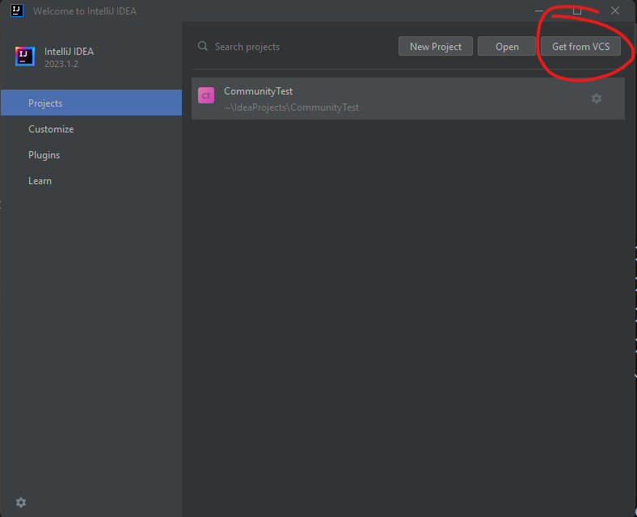
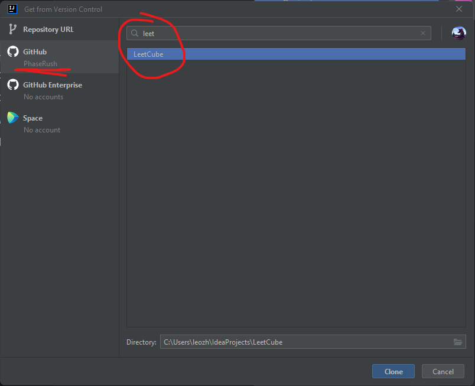
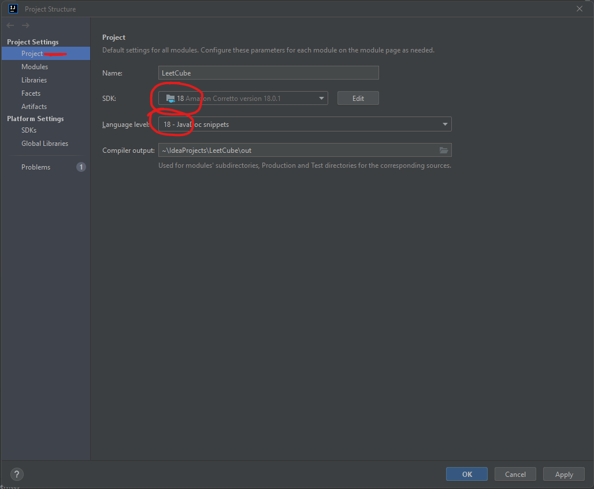
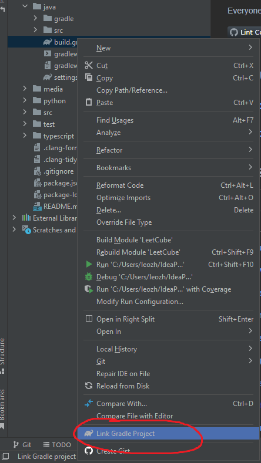
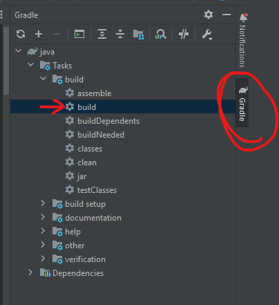
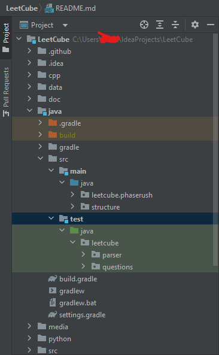

# How to run

Let $n$ be the question number

## C++

### Shell

To compile and run 1 test:

```shell
cd cpp/
make bin/test_n
bin/test_n
```

To compile and run all tests:

`c` is the number of cores to run in parallel, speeds up significantly.
Default to 8 in `test.sh`

```shell
cd cpp/
make run -jc
```

## Python

### Shell

`-s` flag is optional, it shows timing for each individual test.

To run 1 test:

```shell
pytest python/tests/test_n.py -s
```

To run all tests:

```shell
pytest python/tests -s
```

### JetBrains (PyCharm, IntelliJ IDEA, etc)

Follow steps outlined [here](https://www.jetbrains.com/help/pycharm/pytest.html#create-pytest-test).

## JavaScript

### Shell

To run 1 test:

```shell
node --test javascript/test/test_$n.js
```

To run all tests:

```shell
node --test javascript/test/test_*
```

## Java

If you just want to contribute but don't care about running the test suite, then simply use your preferred editor and add your solution files before committing.

The below instructions are assuming you want to run the project following best practices.

### IntelliJ IDEA (Preferred)

Get IntelliJ [from JetBrains](https://www.jetbrains.com/idea/download). If you have a student email, you can get the Ultimate version for free. The community edition is perfectly adequate for this repo.

(Recommended) - [Link IntelliJ with your GitHub](https://www.jetbrains.com/help/idea/github.html)

(Required) - Make sure you have Java installed. This repo requires Java 14+; I'd recommend Java 17 or 18. You can install java on your system first, or [install it through IntelliJ](https://www.jetbrains.com/help/idea/sdk.html)

(Recommended) - [Install gradle natively](https://gradle.org/install/). This is not required, and the wrapper this repo ships with should be enough to bootstrap any actions. However, installing gradle should make things a bit smoother in the beginning.

---

1. [Clone the repo via IntelliJ](https://www.jetbrains.com/help/idea/cloning-repository.html).



2. You can also just use `https://github.com/LeetCube/LeetCube.git`



3. Set up the Project SDK



4. Now, open the `java` folder and right click on `build.gradle`. There should be an option to "link gradle project"



5. Now, on the right side, there should be a Gradle bar. Open that and run the `build` target.



6. The terminal should show all tests passing. Here is what your project structure should look like now:



7. If all goes well, the project should be set up now. Add your new solutions under `java/src/main/java/leetcube/{yourname}/CodeN.java`, and add unit tests to either a new file under `java/src/test/java/leetcube` or under the example given in `java/src/test/java/leetcube/questions/TestBase.java`

### Shell (For advanced users)

Only do this if you don't plan on developing, or if you really know what you're doing.

```shell
### Instructions for advanced users!

# run all tests using the gradle wrapper
gradlew.bat test # for windows
./gradlew test   # for unix

# You can execute other targets using the gradle wrapper (gradlew), such as
gradlew.bat build

# For advanced cli debugging and runtime options, use `tasks` to see options
gradlew.bat tasks

# you can edit the wrapper targets and distributions in java/build.gradle
```
